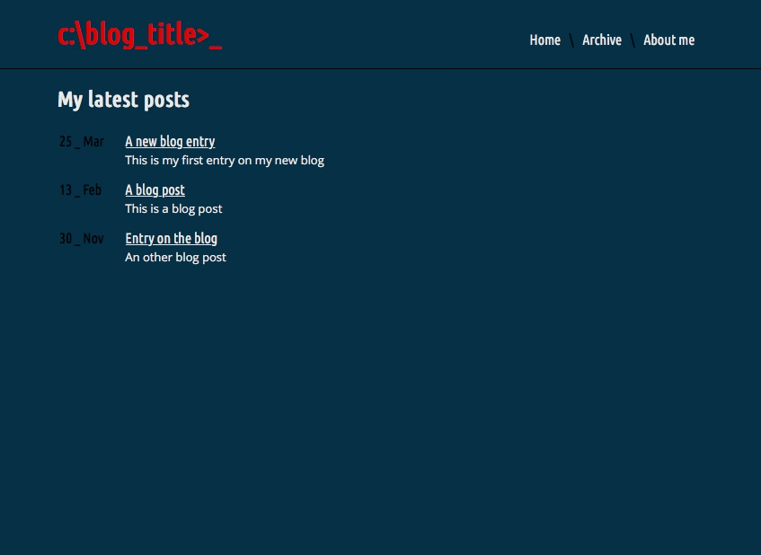
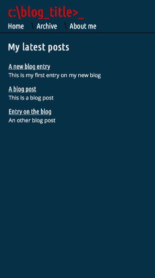
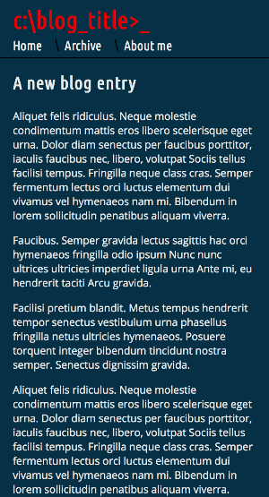

# Static Jekyll based blog

I wanted to take a look at the field of static website generators since a) I knew nothing about it and b) it sounded like an interesting simple solution for a future blog/portfolio. I chose play around with the Jekyll-generator (since it’s also easy and free to host on GitHub Pages). This no nonsense webpage for blogging was the result of my short time testing. Even if it's "only" static webpages, Jekyll is really is cool and quite powerfull if you dive further into it.



It also adapts to smaller screens. Here on an 4.7" iPhone:

  

And the cursor symbol next to the blog title is blinking like a prompt - just for fun.


### Setup

1. Fork this repo

2. Make a branch called ```gh-pages```

3. Change the baseurl in the ```config.yml``` file (the name of your repo) and insert your blog title in the ```default.html``` file.

4. Go to Settings. Change the Source under GitHub Pages to gh-pages - and it's live. The link for your blog will show above the Source-setting.

### How to publish new posts on the blog

1. Write your post in markdown

2. Place this:
```md
---
title: "Post title"
meta: "Text used as the posts subdivision on front page"
layout: default
---
```

in the very top of the document

3. Save your post as a md-file with this naming convention:
```md
yyyy-mm-dd-post-title-seperated-by-minuses.md
```

4. Put the file in the posts folder - and it's live!
