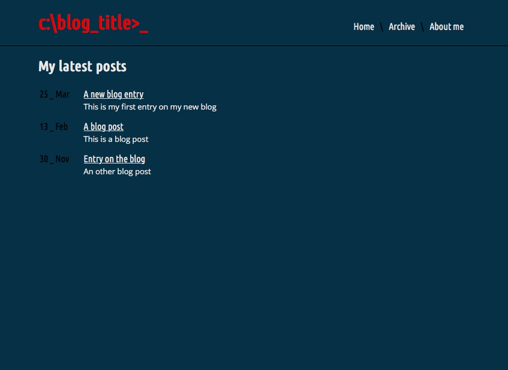

# Static Jekyll based blog

I've stitched together a no nonsense static webpage for blogging. It's based on Jekyll and easy (and free) to host on GitHub Pages. 



Remenber to change the baseurl in the config.yml file and to insert your blog title in the default.html file.

### How to publish new posts on the blog

1. Write your post in markdown

2. Place this:
```md
---
title: "Post title"
meta: "Text used as the posts subdivision on front page"
layout: default
---
```

in the very top of the document

3. Save your post as a md-file with this naming convention:
```md
yyyy-md-dd-post-title-seperated-by-minuses.md
```

4. Put the file in the posts folder - and it's live!
